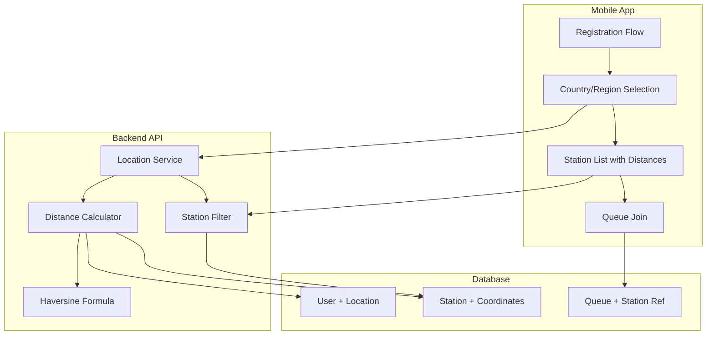

# Design Document: Location-Based Station Discovery

## Overview

This design implements location-based fuel station discovery by adding country, region, vehicle type, and fuel type selection during user registration. The system will filter and display nearby stations based on user location, calculate distances using geographic coordinates, and ensure operators and admins see only relevant regional data. Vehicle information collected during signup enables personalized service and better queue management.

The implementation extends the existing Smart Fuel Station system with minimal disruption to current functionality while adding powerful geographic filtering and vehicle-specific capabilities.

## Architecture

### High-Level Architecture Changes

The location-based feature integrates into the existing three-tier architecture:

1. **Data Layer**: Extended database schema with country, region, and coordinate fields
2. **API Layer**: New endpoints for location data and enhanced filtering on existing endpoints
3. **Client Layer**: Updated UI components for location selection and station display with distances



### Component Interactions

1. **Registration Flow**: User selects country → regions load → selection stored in User table
2. **Station Discovery**: User location → filter stations by region → calculate distances → sort by proximity
3. **Queue Management**: Station selection → validate region match → create queue entry with location data
4. **Operator Panel**: Operator login → load assigned region → filter queues and tickets
5. **Admin Dashboard**: Select region filter → aggregate analytics by geography

## Components and Interfaces

### 1. Database Schema Extensions

#### User Table Modifications
```prisma
model User {
  id            String    @id @default(uuid())
  name          String
  email         String    @unique
  password      String
  role          String    @default("CUSTOMER")
  phone         String?
  country       String    // NEW: User's country
  region        String    // NEW: User's region/state/city
  vehicleType   String    // NEW: User's vehicle type (Car, Bike, Truck, Other)
  fuelType      String    // NEW: User's fuel type (Petrol, Diesel, EV, CNG)
  createdAt     DateTime  @default(now())
  
  vehicles      Vehicle[]
  queues        Queue[]
  logs          Log[]
}
```

#### Station Table Modifications
```prisma
model Station {
  id            String    @id @default(uuid())
  name          String
  location      String
  latitude      Float
  longitude     Float
  country       String    // NEW: Station's country
  region        String    // NEW: Station's region
  status        String    @default("OPEN")
  totalPumps    Int       @default(4)
  createdAt     DateTime  @default(now())

  inventory     StationFuelInventory[]
  queues        Queue[]
}
```

#### New Country and Region Tables
```prisma
model Country {
  id            String    @id @default(uuid())
  name          String    @unique
  code          String    @unique // ISO country code (e.g., "US", "IN")
  createdAt     DateTime  @default(now())
  
  regions       Region[]
}

model Region {
  id            String    @id @default(uuid())
  name          String
  countryId     String
  latitude      Float     // Center point of region
  longitude     Float     // Center point of region
  createdAt     DateTime  @default(now())
  
  country       Country   @relation(fields: [countryId], references: [id])
  
  @@unique([name, countryId])
}
```

### 2. Backend Services

#### Location Service
```javascript
class LocationService {
  // Get all countries
  async getCountries()
  
  // Get regions for a specific country
  async getRegionsByCountry(countryId)
  
  // Validate country and region combination
  async validateLocation(country, region)
  
  // Get region center coordinates
  async getRegionCoordinates(regionId)
}
```

#### Distance Calculator Service
```javascript
class DistanceCalculator {
  // Calculate distance using Haversine formula
  calculateDistance(lat1, lon1, lat2, lon2) {
    const R = 6371; // Earth's radius in km
    const dLat = this.toRad(lat2 - lat1);
    const dLon = this.toRad(lon2 - lon1);
    
    const a = Math.sin(dLat/2) * Math.sin(dLat/2) +
              Math.cos(this.toRad(lat1)) * Math.cos(this.toRad(lat2)) *
              Math.sin(dLon/2) * Math.sin(dLon/2);
    
    const c = 2 * Math.atan2(Math.sqrt(a), Math.sqrt(1-a));
    return R * c; // Distance in km
  }
  
  toRad(degrees) {
    return degrees * (Math.PI / 180);
  }
}
```

#### Station Service Extensions
```javascript
class StationService {
  // Get stations filtered by user's region with distances
  async getStationsByUserLocation(userId) {
    const user = await getUserWithLocation(userId);
    const stations = await getStationsByRegion(user.country, user.region);
    
    return stations.map(station => ({
      ...station,
      distance: this.calculateDistance(
        user.regionLat, user.regionLon,
        station.latitude, station.longitude
      )
    })).sort((a, b) => a.distance - b.distance);
  }
  
  // Validate station belongs to user's region
  async validateStationAccess(userId, stationId)
}
```

### 3. API Endpoints

#### New Location Endpoints
```
GET /api/locations/countries
Response: [{ id, name, code }]

GET /api/locations/countries/:countryId/regions
Response: [{ id, name, countryId, latitude, longitude }]

POST /api/locations/validate
Body: { country, region }
Response: { valid: boolean, message }
```

#### Modified Authentication Endpoints
```
POST /api/auth/register
Body: {
  name, email, password, phone,
  country,     // NEW: Required
  region,      // NEW: Required
  vehicleType, // NEW: Required (Car, Bike, Truck, Other)
  fuelType     // NEW: Required (Petrol, Diesel, EV, CNG)
}
Response: { user, token }

PATCH /api/auth/profile/location
Body: { country, region }
Response: { user }

PATCH /api/auth/profile/vehicle
Body: { vehicleType, fuelType }
Response: { user }
```

#### Modified Station Endpoints
```
GET /api/stations
Query: ?userId=<uuid>
Response: [{
  id, name, location, latitude, longitude,
  country, region,
  distance,  // NEW: Calculated distance in km
  status, totalPumps
}]

GET /api/stations/:id
Response: {
  id, name, location, latitude, longitude,
  country, region,
  distance,  // NEW: If userId provided in query
  status, totalPumps, inventory
}
```

#### Modified Queue Endpoints
```
POST /api/queue/join
Body: { stationId, vehicleId }
Validation: Verify station is in user's region
Response: { queue, ticket }
```

### 4. Mobile App Components (React Native Expo with Dark Mode)

#### Dark Mode Theme Configuration
```javascript
// Theme colors for dark mode
const darkTheme = {
  colors: {
    background: '#121212',
    surface: '#1E1E1E',
    card: '#2C2C2C',
    primary: '#BB86FC',
    secondary: '#03DAC6',
    accent: '#CF6679',
    text: '#FFFFFF',
    textSecondary: '#B3B3B3',
    border: '#3A3A3A',
    success: '#4CAF50',
    warning: '#FFC107',
    error: '#CF6679',
    disabled: '#666666'
  },
  spacing: {
    xs: 4,
    sm: 8,
    md: 16,
    lg: 24,
    xl: 32
  },
  borderRadius: {
    sm: 8,
    md: 12,
    lg: 16,
    xl: 24
  },
  shadows: {
    small: {
      shadowColor: '#000',
      shadowOffset: { width: 0, height: 2 },
      shadowOpacity: 0.25,
      shadowRadius: 3.84,
      elevation: 2
    },
    medium: {
      shadowColor: '#000',
      shadowOffset: { width: 0, height: 4 },
      shadowOpacity: 0.30,
      shadowRadius: 4.65,
      elevation: 4
    }
  }
};
```

#### Registration Screen Updates
```jsx
// New location and vehicle selection steps in registration with dark mode styling
<RegistrationScreen style={styles.darkContainer}>
  <Step1: BasicInfo 
    backgroundColor={darkTheme.colors.surface}
    textColor={darkTheme.colors.text}
  />
  <Step2: LocationSelection>
    <CountryDropdown 
      style={styles.darkDropdown}
      placeholderTextColor={darkTheme.colors.textSecondary}
    />
    <RegionDropdown 
      style={styles.darkDropdown}
      placeholderTextColor={darkTheme.colors.textSecondary}
    />
  </Step2>
  <Step3: VehicleInformation>
    <VehicleTypeDropdown 
      options={['Car', 'Bike', 'Truck', 'Other']}
      style={styles.darkDropdown}
    />
    <FuelTypeDropdown 
      options={['Petrol', 'Diesel', 'EV', 'CNG']}
      style={styles.darkDropdown}
    />
  </Step3>
  <Step4: Confirmation />
</RegistrationScreen>
```

#### Station List Component with Dark Mode
```jsx
<View style={styles.darkBackground}>
  <StationList>
    {stations.map(station => (
      <StationCard
        key={station.id}
        name={station.name}
        address={station.location}
        distance={`${station.distance.toFixed(1)} km`}
        region={station.region}
        status={station.status}
        onSelect={() => navigateToStation(station.id)}
        style={{
          backgroundColor: darkTheme.colors.card,
          borderRadius: darkTheme.borderRadius.md,
          padding: darkTheme.spacing.md,
          marginBottom: darkTheme.spacing.sm,
          ...darkTheme.shadows.medium
        }}
        textStyle={{ color: darkTheme.colors.text }}
      />
    ))}
  </StationList>
</View>
```

#### Common Dark Mode Styles
```javascript
const styles = StyleSheet.create({
  darkContainer: {
    flex: 1,
    backgroundColor: darkTheme.colors.background,
    padding: darkTheme.spacing.md
  },
  darkCard: {
    backgroundColor: darkTheme.colors.card,
    borderRadius: darkTheme.borderRadius.md,
    padding: darkTheme.spacing.md,
    marginBottom: darkTheme.spacing.sm,
    ...darkTheme.shadows.medium
  },
  darkDropdown: {
    backgroundColor: darkTheme.colors.surface,
    borderColor: darkTheme.colors.border,
    borderWidth: 1,
    borderRadius: darkTheme.borderRadius.sm,
    padding: darkTheme.spacing.md,
    color: darkTheme.colors.text,
    marginBottom: darkTheme.spacing.sm
  },
  darkButton: {
    backgroundColor: darkTheme.colors.primary,
    borderRadius: darkTheme.borderRadius.md,
    padding: darkTheme.spacing.md,
    alignItems: 'center',
    ...darkTheme.shadows.small
  },
  darkButtonText: {
    color: darkTheme.colors.text,
    fontSize: 16,
    fontWeight: '600'
  }
});
```
```

### 5. Operator Panel Updates

#### Operator Assignment
- Operators will have `assignedRegion` field added to their User record
- Operator panel filters all data by `assignedRegion`

#### Queue Display
```jsx
<QueueList>
  {queues.map(queue => (
    <QueueItem
      vehicle={queue.vehicle}
      user={queue.user}
      userLocation={`${queue.user.region}, ${queue.user.country}`}
      station={queue.station}
      status={queue.status}
    />
  ))}
</QueueList>
```

### 6. Admin Dashboard Updates

#### Regional Filters
```jsx
<AdminDashboard>
  <FilterBar>
    <CountryFilter onChange={handleCountryChange} />
    <RegionFilter country={selectedCountry} onChange={handleRegionChange} />
  </FilterBar>
  
  <Analytics region={selectedRegion}>
    <StationMap stations={filteredStations} />
    <MetricsCards data={regionalMetrics} />
    <Charts data={regionalData} />
  </Analytics>
</AdminDashboard>
```

## Data Models

### Country Model
```typescript
interface Country {
  id: string;
  name: string;
  code: string;  // ISO 3166-1 alpha-2
  createdAt: Date;
}
```

### Region Model
```typescript
interface Region {
  id: string;
  name: string;
  countryId: string;
  latitude: number;   // Center point
  longitude: number;  // Center point
  createdAt: Date;
}
```

### Extended User Model
```typescript
interface User {
  id: string;
  name: string;
  email: string;
  password: string;
  role: 'CUSTOMER' | 'OPERATOR' | 'ADMIN';
  phone?: string;
  country: string;         // NEW
  region: string;          // NEW
  vehicleType: string;     // NEW: Car, Bike, Truck, Other
  fuelType: string;        // NEW: Petrol, Diesel, EV, CNG
  assignedRegion?: string; // NEW: For operators
  createdAt: Date;
}
```

### Extended Station Model
```typescript
interface Station {
  id: string;
  name: string;
  location: string;
  latitude: number;
  longitude: number;
  country: string;   // NEW
  region: string;    // NEW
  status: 'OPEN' | 'CLOSED' | 'MAINTENANCE';
  totalPumps: number;
  createdAt: Date;
}
```

### Station with Distance
```typescript
interface StationWithDistance extends Station {
  distance: number;  // Calculated distance in km
}
```

## Corr
ectness Properties

*A property is a characteristic or behavior that should hold true across all valid executions of a system-essentially, a formal statement about what the system should do. Properties serve as the bridge between human-readable specifications and machine-verifiable correctness guarantees.*

### Property 1: Region filtering by country
*For any* country with associated regions, querying regions by that country should return only regions belonging to that country and no regions from other countries.
**Validates: Requirements 1.2**

### Property 2: User location persistence
*For any* user registration with valid country and region, storing the user then retrieving it should return the same country and region values.
**Validates: Requirements 1.3**

### Property 3: Registration validation rejects missing location
*For any* registration attempt with missing country or missing region or both, the system should reject the registration and return a validation error.
**Validates: Requirements 1.4**

### Property 4: Country-region combination validation
*For any* country-region pair, the validation should accept it if and only if that region exists in the database for that country.
**Validates: Requirements 1.5**

### Property 5: Station filtering by user region
*For any* user with a specific country and region, fetching stations should return only stations that match both the user's country and region.
**Validates: Requirements 2.1**

### Property 6: Station display includes required fields
*For any* station returned to a user, the response should contain name, address, distance, latitude, longitude, country, and region fields.
**Validates: Requirements 2.2**

### Property 7: Haversine distance calculation accuracy
*For any* two coordinate pairs (lat1, lon1) and (lat2, lon2), the calculated distance using the Haversine formula should match the expected great-circle distance within 0.1 km tolerance.
**Validates: Requirements 2.3, 7.1**

### Property 8: Station sorting by distance
*For any* list of stations with calculated distances, the returned list should be sorted in ascending order by distance value.
**Validates: Requirements 2.5**

### Property 9: Queue-station association
*For any* queue entry created for a station, retrieving that queue entry should return the correct station identifier.
**Validates: Requirements 3.2**

### Property 10: QR ticket contains location data
*For any* generated QR ticket, parsing the QR code data should reveal the station identifier and user region information.
**Validates: Requirements 3.3**

### Property 11: Cross-region queue prevention
*For any* user attempting to join a queue at a station outside their region, the system should reject the request and return an authorization error.
**Validates: Requirements 3.4**

### Property 12: Queue entry records location
*For any* created queue entry, the stored record should include the station's location data and the user's region.
**Validates: Requirements 3.5**

### Property 13: Operator regional filtering
*For any* operator with an assigned region, fetching stations and queues should return only data from that assigned region.
**Validates: Requirements 4.1, 4.5**

### Property 14: Operator ticket region validation
*For any* operator attempting to scan a ticket, the system should allow the scan if and only if the ticket's station is in the operator's assigned region.
**Validates: Requirements 4.2, 4.4**

### Property 15: Queue display includes user location
*For any* queue entry displayed to an operator, the entry should include the user's country and region information.
**Validates: Requirements 4.3**

### Property 16: Admin country aggregation
*For any* country filter selected by an admin, the aggregated metrics should include data from all regions within that country and no data from other countries.
**Validates: Requirements 5.2**

### Property 17: Admin region filtering
*For any* region filter selected by an admin, the displayed data should include only stations and queues from that specific region.
**Validates: Requirements 5.3**

### Property 18: Analytics grouping by geography
*For any* analytics query, the returned metrics should be correctly grouped by country and region dimensions.
**Validates: Requirements 5.4**

### Property 19: Map displays filtered stations
*For any* geographic filter (country or region), the map view should display only stations within the selected geographic area.
**Validates: Requirements 5.5**

### Property 20: Non-empty location validation
*For any* user or station creation attempt with empty country or empty region fields, the system should reject the operation and return a validation error.
**Validates: Requirements 6.4**

### Property 21: Distance formatting precision
*For any* calculated distance value, the displayed distance should be formatted in kilometers with exactly one decimal place.
**Validates: Requirements 7.2**

### Property 22: Distance recalculation on location update
*For any* user whose location (country/region) is updated, fetching stations should return recalculated distances based on the new location.
**Validates: Requirements 7.4**

### Property 23: Stations without coordinates sorted last
*For any* station list containing stations with and without coordinate data, stations with unavailable coordinates should appear after all stations with valid distances in the sorted list.
**Validates: Requirements 7.5**

## Error Handling

### Validation Errors

1. **Missing Location Data**
   - Error Code: `LOCATION_REQUIRED`
   - Message: "Country and region are required"
   - HTTP Status: 400

2. **Invalid Country-Region Combination**
   - Error Code: `INVALID_LOCATION`
   - Message: "The selected region does not exist in the specified country"
   - HTTP Status: 400

3. **Cross-Region Access Denied**
   - Error Code: `REGION_MISMATCH`
   - Message: "Cannot access resources outside your assigned region"
   - HTTP Status: 403

4. **Station Not Found in Region**
   - Error Code: `STATION_NOT_IN_REGION`
   - Message: "The selected station is not available in your region"
   - HTTP Status: 404

### Distance Calculation Errors

1. **Missing Coordinates**
   - Behavior: Display "Distance unavailable" instead of throwing error
   - Fallback: Place station at end of sorted list

2. **Invalid Coordinates**
   - Error Code: `INVALID_COORDINATES`
   - Message: "Station coordinates are invalid"
   - HTTP Status: 500

### Database Errors

1. **Location Data Constraint Violation**
   - Error Code: `DB_CONSTRAINT_ERROR`
   - Message: "Location data violates database constraints"
   - HTTP Status: 500
   - Action: Log error and rollback transaction

2. **Region Not Found**
   - Error Code: `REGION_NOT_FOUND`
   - Message: "The specified region does not exist"
   - HTTP Status: 404

## Testing Strategy

### Unit Testing

Unit tests will verify specific examples and edge cases:

1. **Location Service Tests**
   - Test getting countries returns expected list
   - Test getting regions for a specific country
   - Test validation with valid and invalid location combinations
   - Test handling of empty or null location values

2. **Distance Calculator Tests**
   - Test Haversine formula with known coordinate pairs
   - Test distance calculation with same coordinates (should be 0)
   - Test distance formatting to one decimal place
   - Test handling of invalid coordinates

3. **Station Service Tests**
   - Test filtering stations by region
   - Test sorting stations by distance
   - Test handling stations without coordinates
   - Test distance calculation integration

4. **Queue Service Tests**
   - Test queue creation with location validation
   - Test cross-region queue prevention
   - Test QR ticket generation includes location data

5. **API Endpoint Tests**
   - Test registration with and without location data
   - Test station listing with user location filtering
   - Test operator panel regional filtering
   - Test admin dashboard geographic filters

### Property-Based Testing

Property-based tests will verify universal properties across all inputs using **fast-check** (JavaScript/TypeScript property testing library). Each test will run a minimum of 100 iterations.

1. **Property Test: Region filtering by country** (Property 1)
   - Generate random countries with regions
   - Verify querying by country returns only that country's regions
   - **Feature: location-based-stations, Property 1: Region filtering by country**

2. **Property Test: User location persistence** (Property 2)
   - Generate random users with valid locations
   - Verify round-trip save/retrieve preserves location data
   - **Feature: location-based-stations, Property 2: User location persistence**

3. **Property Test: Registration validation** (Property 3)
   - Generate registration data with missing location fields
   - Verify all invalid combinations are rejected
   - **Feature: location-based-stations, Property 3: Registration validation rejects missing location**

4. **Property Test: Location combination validation** (Property 4)
   - Generate valid and invalid country-region pairs
   - Verify validation accepts only valid combinations
   - **Feature: location-based-stations, Property 4: Country-region combination validation**

5. **Property Test: Station filtering** (Property 5)
   - Generate users and stations in various regions
   - Verify each user sees only their regional stations
   - **Feature: location-based-stations, Property 5: Station filtering by user region**

6. **Property Test: Haversine accuracy** (Property 7)
   - Generate random coordinate pairs
   - Verify calculated distance matches expected formula result
   - **Feature: location-based-stations, Property 7: Haversine distance calculation accuracy**

7. **Property Test: Distance sorting** (Property 8)
   - Generate random station lists with distances
   - Verify returned list is sorted ascending by distance
   - **Feature: location-based-stations, Property 8: Station sorting by distance**

8. **Property Test: Cross-region prevention** (Property 11)
   - Generate users and stations in different regions
   - Verify cross-region queue attempts are rejected
   - **Feature: location-based-stations, Property 11: Cross-region queue prevention**

9. **Property Test: Operator filtering** (Property 13)
   - Generate operators with assigned regions and multi-region data
   - Verify operators see only their regional data
   - **Feature: location-based-stations, Property 13: Operator regional filtering**

10. **Property Test: Distance recalculation** (Property 22)
    - Generate users, update their locations, fetch stations
    - Verify distances are recalculated for new location
    - **Feature: location-based-stations, Property 22: Distance recalculation on location update**

### Integration Testing

1. **End-to-End Registration Flow**
   - Complete registration with location selection
   - Verify user can see regional stations
   - Verify user can join queue at regional station

2. **Cross-Component Location Flow**
   - User joins queue → Operator sees in their panel → Admin sees in analytics
   - Verify location data flows correctly through all components

3. **Geographic Filtering Across Roles**
   - Create multi-region test data
   - Verify customers, operators, and admins see correct filtered data

### Migration Testing

1. **Schema Migration Test**
   - Run migration on test database
   - Verify new columns exist with correct types
   - Verify existing data is preserved

2. **Data Migration Test**
   - Create test data without location fields
   - Run data migration script
   - Verify default values are applied correctly

3. **Backward Compatibility Test**
   - Verify existing API endpoints still function
   - Verify existing queue entries remain valid
