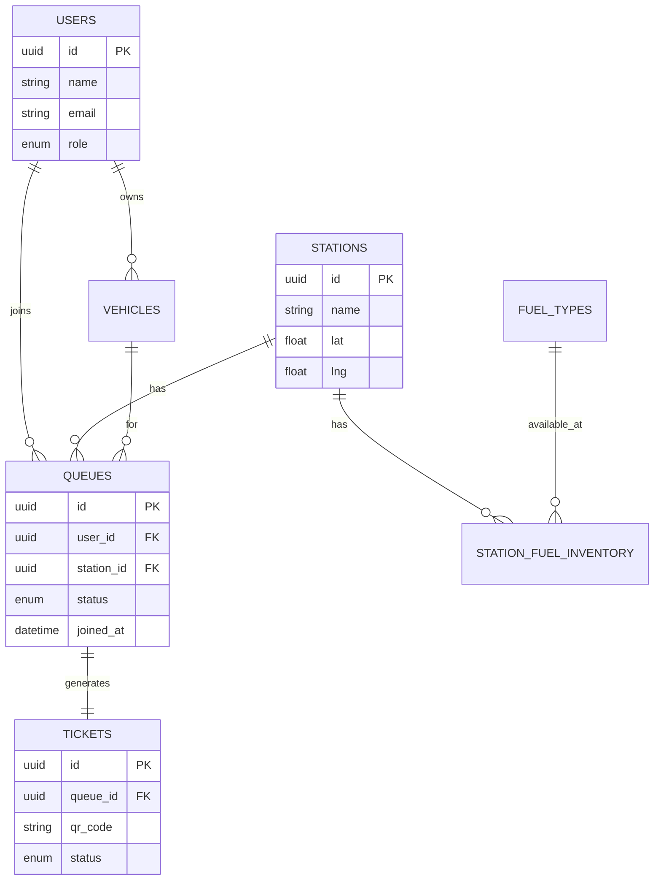

# Database Schema Design

## 1. Entities

### Users
*   Stores profile information for all roles (Customer, Operator, Admin).
*   Fields: `id`, `name`, `email`, `password_hash`, `phone`, `role`, `created_at`.

### Stations
*   Represents physical fuel stations.
*   Fields: `id`, `name`, `location_lat`, `location_lng`, `address`, `total_pumps`, `status` (Open/Closed), `created_at`.

### FuelTypes
*   Types of fuel available (Petrol, Diesel, EV, etc.).
*   Fields: `id`, `name`, `unit_price` (optional), `created_at`.

### StationFuelInventory (Join Table)
*   Links stations to fuel types and tracks availability/status.
*   Fields: `station_id`, `fuel_type_id`, `is_available`.

### Vehicles
*   Vehicles registered by customers.
*   Fields: `id`, `user_id`, `license_plate`, `vehicle_type` (Car/Bike/Truck), `fuel_type_id`, `created_at`.

### Queues
*   The virtual line for a specific station.
*   Fields: `id`, `station_id`, `user_id`, `vehicle_id`, `status` (Waiting, Serving, Completed, Cancelled), `ticket_id`, `joined_at`, `estimated_service_time`.

### Tickets
*   The proof of booking.
*   Fields: `id`, `queue_id`, `qr_code_data`, `status` (Active, Scanned, Expired), `generated_at`, `expires_at`.

### Logs / Audit
*   System activity tracking.
*   Fields: `id`, `user_id`, `action`, `metadata`, `created_at`.

## 2. Schema Relationship Diagram (Mermaid)

