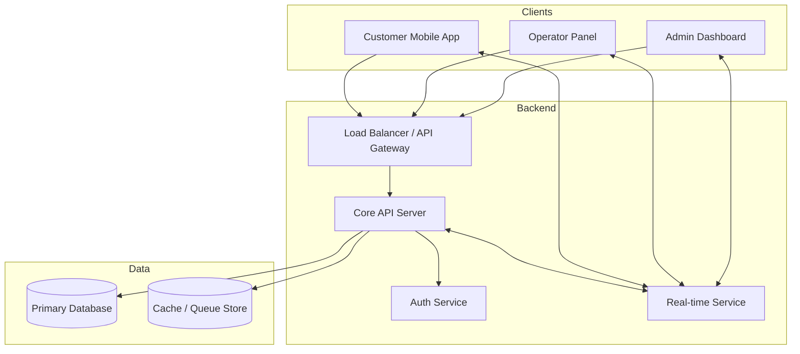

# System Architecture & Blueprint

## 1. Overview
The Smart Fuel Station Queue Management System is designed to eliminate physical waiting lines by introducing virtual queues. It consists of four main components: a mobile app for customers, a web panel for operators, an admin dashboard, and a central backend.

## 2. User Roles
*   **Customer**: Uses the mobile app to book slots, join queues, and receive QR-based e-tickets.
*   **Operator**: Station staff who use a web interface to verify vehicle tickets via QR scan and manage local fuel distribution.
*   **Administrator**: Superusers who monitor the entire system, manage stations, viewing real-time analytics and logs.

## 3. System Modules
### A. Customer Mobile App
*   **Tech Stack**: React Native (Expo) or similar cross-platform framework.
*   **Responsibilities**: User auth, Station locator, Queue joining, Ticket display (QR), Real-time status updates.

### B. Operator Panel
*   **Tech Stack**: Modern Web Framework (React/Next.js/Vite).
*   **Responsibilities**: Operator auth, QR Scanning (Camera integration), Ticket verification, Queue management (mark as served), Offline logic (optional).

### C. Admin Dashboard
*   **Tech Stack**: Modern Web Framework (React/Next.js/Vite).
*   **Responsibilities**: Station management, Analytics (traffic, fuel usage), User management, System logs.

### D. Backend Core
*   **Tech Stack**: Node.js/Express or Python/FastAPI.
*   **Responsibilities**: RESTful APIs, Database management, Real-time coordination (Socket.io/WebSockets), Authentication (JWT), Business logic (Queue algorithms).

## 4. Architecture Diagram (Mermaid)

